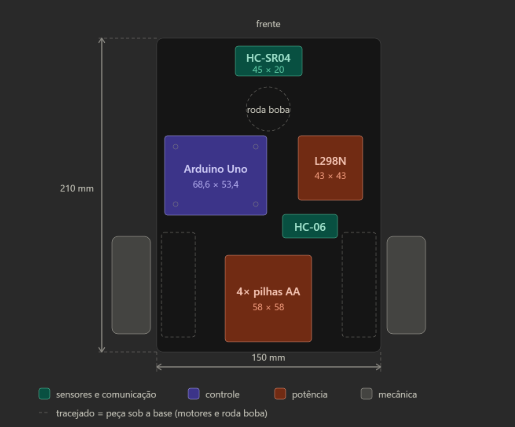

# cp-arduino-car

## 👥 Integrantes do Grupo

| Nome                           | RM     |
| ------------------------------ | ------ |
| Kaiky Alvaro Miranda           | 98118  |
| Guilherme Morais  Barbosa      | 551981 |
| Juan Pinheiro de França        | 552202 |
| Matheus Gusmão Aragão          | 550826 |
| Júlia Marques Mendes das Neves | 98680  |

# Lista de Materiais — Projeto Carrinho-Robô

**Disciplina:** Project-based Maker Lab — Profª Dra. Gedeane G. S. Kenshima
**Aula 13:** Requisitos do projeto — carrinho-robô
**Levantamento de preços:** 14/08/2026

> ⚠️ Preços de e-commerce mudam com frequência e vários itens estavam em promoção
> na data da consulta. Confirme os valores antes de fechar a compra.

---

## 1. Decisão de estratégia: kit pronto ou peças avulsas?

A tarefa pede um **croqui de chassi próprio**, ou seja, vocês vão projetar a placa
base. Isso abre dois caminhos:

| Cenário | Como funciona | Quando faz sentido |
|---|---|---|
| **A — Kit 2WD pronto** | Compra o kit completo (chassi + motores + rodas + roda boba + parafusos) e usa o chassi de fábrica | Prazo curto, orçamento apertado, foco na programação |
| **B — Peças avulsas + chassi próprio** | Compra só motores, rodas, roda boba e eletrônica; a placa base vocês cortam (MDF/acrílico/PLA) a partir do croqui | Entrega alinhada com o objetivo da tarefa: projetar o chassi |
| **C — Híbrido (recomendado)** | Compra o kit 2WD (sai mais barato que as peças soltas) e **reaproveita motores/rodas/ferragem** num chassi novo, cortado a partir do croqui | Melhor custo-benefício: valida o croqui sem perder o kit como plano B |

**Sugestão:** cenário C. O kit 2WD custa menos do que motor + roda + roda boba
comprados separadamente, e o chassi de acrílico que vem nele serve de gabarito para
conferir se as medidas do croqui de vocês batem com a realidade.

---

## 2. Lista de materiais (BOM)

### 2.1 Itens essenciais

| # | Item | Especificação | Qtd | Observação |
|---|---|---|---|---|
| 1 | Placa controladora | Arduino Uno R3 (SMD CH340) + cabo USB | 1 | Nano se o chassi for compacto |
| 2 | Driver de motor | Ponte H L298N — 43 × 43 × 27 mm, 2 A/canal | 1 | Já usado em aula |
| 3 | Motores DC | 3–6 V com caixa de redução 48:1 | 2 | Vêm no kit chassi |
| 4 | Rodas | Ø 65 mm emborrachadas | 2 | Vêm no kit chassi |
| 5 | Roda boba | Universal / castor | 1 | Vem no kit chassi |
| 6 | Sensor de distância | HC-SR04 — 45 × 20 × 17 mm, 2 cm a 4 m | 1 | |
| 7 | Módulo Bluetooth | HC-06 (slave) ou HC-05 (master/slave) | 1 | HC-06 basta para controle por app |
| 8 | Alimentação motores | Suporte 4× AA ou 2× 18650 + suporte | 1 | Vem no kit chassi (4× AA) |
| 9 | Chave liga/desliga | Gangorra ou alavanca 2 pinos | 1 | Facilita muito o teste |
| 10 | Jumpers | Macho/fêmea e macho/macho, 20 cm | 2 kits | |
| 11 | Chassi | Kit 2WD acrílico OU chapa para corte | 1 | Ver seção 1 |

### 2.2 Itens de apoio (não obrigatórios, mas salvam a montagem)

| Item | Por quê |
|---|---|
| Suporte plástico para HC-SR04 | Fixa o sensor na borda frontal sem gambiarra |
| Mini protoboard 170 furos | Distribui 5 V e GND sem solda |
| Espaçadores/parafusos M3 (kit sortido) | O slide "Discussão técnica" cita dificuldade com parafusos |
| Barra de pinos + fio | Para prolongar as ligações do motor |
| Cabo adaptador P4 para bateria 9 V | Alimentação separada do Arduino |
| Abraçadeiras (hellerman) | Organiza a fiação, evita fio na roda |

---

## 3. Preços por loja (confirmados em 14/08/2026)

### Instituto Digital — melhor custo-benefício geral
🔗 https://institutodigital.com.br/
💬 Falar com a **Thais** por WhatsApp: (11) 96298-1853 — dizer que é aluno da Gedeane
💰 Todos os preços têm **5% de desconto no PIX**

| Item | Preço | PIX | Link |
|---|---|---|---|
| Kit Chassi 2WD (chassi + 2 motores + 2 rodas 65 mm + roda boba + suporte pilhas) | ~~R$ 107,90~~ **R$ 75,90** | — | [ver](https://institutodigital.com.br/produto/kit-chassi-2wd-robo-para-arduino/) |
| Arduino Uno R3 SMD CH340 + cabo USB | R$ 38,99 | R$ 37,04 | [ver](https://institutodigital.com.br/produto/arduino-uno-r3-smd-ch340-cabo-usb/) |
| Driver Ponte H L298N | R$ 13,85 | R$ 13,16 | [ver](https://institutodigital.com.br/produto/driver-motor-ponte-h-l298n-para-arduino/) |
| Módulo Bluetooth HC-06 (slave) | R$ 29,90 | R$ 28,41 | [ver](https://institutodigital.com.br/produto/modulo-bluetooth-hc-06-rs232-slave-para-arduino/) |
| Módulo Bluetooth HC-05 (master/slave) | R$ 54,90 | R$ 52,16 | [ver](https://institutodigital.com.br/produto/modulo-bluetooth-hc-05-rs232-master-slave/) |
| Sensor Ultrassônico HC-SR04 | *consultar* | — | [ver](https://institutodigital.com.br/produto/sensor-ultrassonico-hc-sr04-distancia/) |
| Suporte para HC-SR04 (azul) | ~~R$ 7,45~~ **R$ 5,85** | — | [ver](https://institutodigital.com.br/produto/suporte-para-sensor-ultrassonico-hc-sr04-azul/) |
| Jumper macho/fêmea 20 cm — 20 un. | R$ 3,68 | R$ 3,50 | [ver](https://institutodigital.com.br/produto/jumper-macho-femea-20cm-x-20-unidades/) |
| Mini regulador step-down Buck 360 (3 A) | R$ 8,19 | R$ 7,78 | [ver](https://institutodigital.com.br/produto/mini-regulador-de-tensao-step-down-buck-360-3a/) |

**Especificações do kit chassi 2WD:** chassi 22 × 14,7 cm · rodas 7 × 7 × 2,6 cm
(perímetro 22 cm) · motores 3–6 V DC, 120 mA máx., redução 48:1, 260 rpm a 6 V ·
velocidade ~1 m/s · acrílico com película de proteção.

---

### RoboCore
🔗 https://www.robocore.net/ · (11) 3522-7626 · Santana de Parnaíba/SP

| Item | Preço | Status |
|---|---|---|
| Kit Chassi 2WD com motores e rodas | **R$ 47,40** | ⚠️ **Fora de estoque** na consulta |
| Plataforma Robótica Falcon V2 | R$ 114,00 (PIX) | Preço informado no slide da aula |

**Atenção (informação da própria loja):** o chassi 2WD da RoboCore **não tem furação
compatível com o Arduino Uno** — a fixação teria que ser por fita dupla-face. Como
vocês vão projetar o próprio chassi, esse ponto deixa de ser problema: basta incluir
a furação correta no croqui.

O Falcon é a opção mais robusta (chassi em material resistente, não acrílico) e é o
que a professora mostrou em aula. Se o orçamento permitir e o grupo quiser priorizar
durabilidade, vale.

---

### A2 Robotics — bom para módulos avulsos
🔗 https://www.a2robotics.com.br/ · (11) 93731-3030

| Item | Preço | PIX |
|---|---|---|
| Módulo Bluetooth HC-05 | R$ 29,85 | R$ 28,36 |
| Módulo Bluetooth HC-06 | R$ 27,00 | R$ 25,65 |
| Suporte para HC-SR04 | R$ 4,50 | R$ 4,28 |
| Sensor Ultrassônico HC-SR04 | *consultar* | — |

💡 **O HC-05 aqui sai quase pela metade do preço do Instituto Digital** (R$ 28,36 vs
R$ 52,16 no PIX). Se quiserem o HC-05, vale comparar. Para o HC-06 a diferença é
pequena e não compensa pagar dois fretes.

---

### Casa da Robótica
🔗 https://www.casadarobotica.com/
🎟️ **Cupom: PROFGEDEANE**

| Item | Observação |
|---|---|
| [Driver Ponte H Dupla L298N](https://www.casadarobotica.com/driver-ponte-h-dupla-l298n-motor-de-passo-ou-dc-arduino-esp) | 43 × 43 × 27 mm, 30 g, 2 A/canal |
| [Mini Driver Ponte H L298N](https://www.casadarobotica.com/ver-mais/mini-driver-motor-ponte-h-l298n) | 25 × 21 × 7 mm, 3 g — versão compacta, 1,5 A/canal |
| [Shield Ponte H L298NH para Uno/Mega](https://www.casadarobotica.com/placas-embarcadas/compativeis-com-arduino/shield/shield-uno-mega-ponte-h-driver-controlador-para-motor-l298nh) | Encaixa direto no Arduino, economiza espaço e fiação |

💡 **O mini driver (25 × 21 × 7 mm) é uma ótima carta na manga** se o croqui de vocês
ficar apertado: ocupa ~1/4 da área do L298N tradicional e dispensa o dissipador.
Corrente menor (1,5 A/canal), mas os motores do kit puxam só 120 mA — sobra folga.
Vale citar essa comparação na ficha de requisitos como decisão de projeto justificada.

---

### Lojas físicas — Santa Ifigênia (para comprar no mesmo dia)

| Loja | Site | Contato (dizer que é aluno da Gedeane) |
|---|---|---|
| Saravati | https://www.saravati.com.br/ | Fabio ou Jonas |
| Mamute Eletrônica | https://www.mamuteeletronica.com.br/ | Fabio, Rodrigo ou Rogério |

Vantagem: sem frete, sem espera, e dá para **conferir as medidas com paquímetro na
hora** — o que ajuda direto no passo 1 da ficha de requisitos.

---

### Outras opções

| Loja | Site | Perfil |
|---|---|---|
| MakerHero | https://www.makerhero.com/ | Suporte técnico bom, preço médio-alto |
| Vida de Silício | https://vidadesilicio.com.br/ | Excelente conteúdo/tutoriais em PT-BR |
| MercadoLivre / Shopee | — | Preço baixo, qualidade irregular |
| AliExpress | — | Mais barato, mas prazo de 20 a 60 dias |

⚠️ **Não conte com AliExpress para este projeto** — o prazo de entrega não fecha com
o calendário da disciplina.

---

## 4. Estimativa de custo

### Cenário C (recomendado) — kit + eletrônica, uma loja só

| Item | Valor (PIX) |
|---|---|
| Kit Chassi 2WD | R$ 75,90 |
| Arduino Uno + cabo USB | R$ 37,04 |
| Ponte H L298N | R$ 13,16 |
| Módulo Bluetooth HC-06 | R$ 28,41 |
| Sensor HC-SR04 + suporte | ~R$ 25,00 |
| Jumpers (2 kits) | R$ 7,00 |
| Chave, parafusos, extras | ~R$ 20,00 |
| **Subtotal** | **~R$ 206,50** |
| Frete | ~R$ 25,00 |
| **Total estimado** | **~R$ 231,50** |
| **Por pessoa (grupo de 4)** | **~R$ 58,00** |

### Economia possível

- Se alguém do grupo **já tem Arduino Uno** de outra disciplina: **−R$ 37**
- Comprando na Santa Ifigênia: **−R$ 25** de frete
- Usando o cupom `PROFGEDEANE` na Casa da Robótica: desconto adicional
- Material do chassi (MDF 3 mm ou acrílico): o laboratório maker da FIAP costuma
  ter chapa e cortadora a laser — **confirmar com a professora antes de comprar**

---

## 5. Ordem de compra sugerida

1. **Antes de comprar qualquer coisa:** faça o inventário do que o grupo já tem.
   Arduino, jumpers e protoboard costumam sobrar de disciplinas anteriores.
2. **Pergunte à professora** se o laboratório fornece chapa para corte a laser. Isso
   muda completamente o cenário de compra.
3. **Feche tudo numa loja só** para pagar um frete apenas. O Instituto Digital cobre
   praticamente toda a lista.
4. **Confirme o estoque** antes de finalizar — o chassi da RoboCore, por exemplo,
   estava indisponível na consulta.
5. **Peça o desconto de aluno** por WhatsApp antes de fechar o carrinho.

---

## 6. Checklist antes de finalizar o pedido

- [ ] Inventário do que o grupo já possui
- [ ] Confirmado se o lab da FIAP fornece a chapa do chassi
- [ ] Medidas reais dos componentes anotadas (para a ficha de requisitos)
- [ ] Definido HC-05 ou HC-06 (HC-06 basta para controle por app Android)
- [ ] Definido L298N padrão ou mini (impacta a área do croqui)
- [ ] Alimentação dos motores **separada** da lógica do Arduino, com GND comum
- [ ] Prazo de entrega compatível com a data de entrega do projeto
- [ ] Desconto de aluno / cupom aplicado
- [ ] Frete unificado em uma única loja

---

## 7. Fontes consultadas

- Instituto Digital — https://institutodigital.com.br/
- RoboCore — https://www.robocore.net/
- Casa da Robótica — https://www.casadarobotica.com/
- A2 Robotics — https://www.a2robotics.com.br/
- MakerHero — https://www.makerhero.com/
- Vida de Silício — https://vidadesilicio.com.br/
- Saravati — https://www.saravati.com.br/
- Mamute Eletrônica — https://www.mamuteeletronica.com.br/

As decisões de projeto por trás desse layout, que vocês podem copiar direto para a coluna "Justificativa" da ficha:
Bateria sobre o eixo motriz. O suporte de 4× AA é o item mais pesado (~110 g com as pilhas) e está posicionado entre Y=145 e Y=203 mm, exatamente sobre a linha dos motores. Isso joga o centro de massa em cima das rodas de tração e evita que o carrinho patine na partida ou empine ao frear.
Roda boba na frente, motores atrás. Como o peso está atrás, a roda boba fica descarregada — ela só apoia, não sustenta. É por isso que ela pode ser pequena (Ø 30 mm) sem comprometer a estabilidade.
HC-06 no lado oposto ao L298N. A ponte H chaveia corrente nos motores e gera ruído eletromagnético; o módulo Bluetooth é o componente mais sensível a isso. Separá-los diagonalmente é praticamente de graça no croqui e evita queda de conexão durante a locomoção.
Sensor na borda frontal, sem parafuso à frente. O HC-SR04 tem cone de detecção de 15°. Qualquer parafuso ou espaçador na frente dele vira eco falso.

O que ainda falta vocês acrescentarem antes de entregar:
Cotas de furação — a posição de cada furo M3 medida a partir de uma referência única (canto frontal esquerdo, por exemplo). Deixei os 4 furos do Arduino indicados como circunferências, mas sem cota. Essa é a informação que efetivamente permite cortar a peça.
Recorte do eixo dos motores — os eixos atravessam a lateral da base. Marquem a fenda ou o rebaixo.
Vista lateral — mostra a altura livre do solo (~15 a 20 mm com roda de 65 mm e motor sob a chapa) e a altura total da pilha de componentes.

Passagem de fiação — dois ou três rasgos oblongos entre a região dos motores e a ponte H.
Acesso ao USB e ao reset — o Arduino está com a lateral esquerda a 5 mm da borda; confiram se o conector USB fica acessível ou girem a placa 180°.
Legenda numerada casando com os IDs da ficha de requisitos.
A escala aqui é 1,9 px/mm, então o desenho não está em escala de impressão. Para o entregável, refaçam em escala 1:1 ou 1:2 no Fusion 360, Inkscape ou até no Figma — qualquer um exporta DXF, que é o formato que a cortadora a laser do lab pede.

## 8. Componentes - dimensões

| Componente     | Comprimento | Largura | Altura | Forma de Fixação |
| -------------- | ----------- | ------- | ------ | ---------------- |
| Motor Esquerdo | 68,9        | 17,1    | 21,5   |                  |
| Motor direito  | 68,9        | 17,1    | 21,5   |                  |
| Arduino/ESP32  | 50,7        | 27,6    | 11,1   |                  |
| Ponte H        | 41,3        | 41,3    | 25,6   |                  |
| Bateria        | 74,05       | 20,7    | 20,8   |                  |
| Sensor         | 44,6        | 19,1    | 14,4   |                  |
