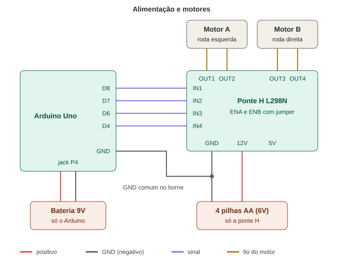
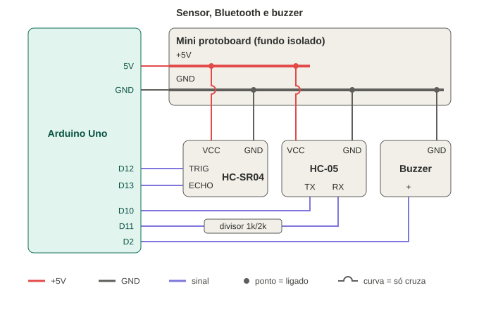

# Hardware e eletrônica

[← Voltar ao README](../README.md)

## 1. Lista de componentes (versão final)

| # | Componente | Função | Qtd |
|---|---|---|---|
| 1 | **Arduino Uno R3** | Microcontrolador: lê comandos e o sensor, aciona os motores | 1 |
| 2 | **Ponte H L298N** | Driver dos motores (sentido de giro dos 2 motores) | 1 |
| 3 | **Motor DC 3–6 V com caixa de redução 48:1** | Tração (roda esquerda e direita) | 2 |
| 4 | Rodas Ø 65 mm + roda boba | Locomoção | 2 + 1 |
| 5 | **Módulo Bluetooth HC-05** | Comunicação sem fio com o celular | 1 |
| 6 | **Sensor ultrassônico HC-SR04** | Medição de distância / detecção de obstáculo | 1 |
| 7 | Buzzer | Alerta sonoro de obstáculo | 1 |
| 8 | Suporte com **4 pilhas AA** (6 V) | Alimentação dos motores (ponte H) | 1 |
| 9 | **Bateria 9 V** + conector P4 | Alimentação do Arduino | 1 |
| 10 | Mini protoboard | Distribuição de 5 V e GND para sensor, Bluetooth e buzzer | 1 |
| 11 | Resistores 1 kΩ e 2 kΩ | Divisor de tensão no RX do HC-05 (5 V → 3,3 V) | 1 + 1 |
| 12 | Jumpers macho/macho e macho/fêmea | Ligações | — |

A pesquisa de preços e fornecedores está em [Lista de materiais (Aula 13)](lista-de-materiais-aula13.md).

> **Protótipo anterior (21/08):** a primeira versão usou **ESP32** com controle por **Wi-Fi** (página web) e **2 baterias 18650**. Veja a [evolução do projeto](01-requisitos-e-planejamento.md#7-evolução-e-alterações).

## 2. Microcontrolador

**Arduino Uno R3 (ATmega328P)**, programado em C++ pela Arduino IDE. Pinos usados:

| Pino | Ligado em | Função |
|---|---|---|
| D2 | Buzzer (+) | Alerta sonoro |
| D4 | L298N IN4 | Motor B (direita) — ré |
| D6 | L298N IN3 | Motor B (direita) — frente |
| D7 | L298N IN2 | Motor A (esquerda) — ré |
| D8 | L298N IN1 | Motor A (esquerda) — frente |
| D10 | HC-05 TX | Recebe comandos do celular (RX do SoftwareSerial) |
| D11 | HC-05 RX (via divisor 1k/2k) | Envia dados ao celular (TX do SoftwareSerial) |
| D12 | HC-SR04 TRIG | Dispara o pulso ultrassônico |
| D13 | HC-SR04 ECHO | Recebe o eco |
| 5V / GND | Mini protoboard | Alimenta HC-05, HC-SR04 e buzzer |
| GND | Borne GND do L298N | **GND comum** com a alimentação dos motores |

Os pinos D0/D1 (serial USB) ficam livres para gravar o código e acompanhar o Monitor Serial.

## 3. Motores e ponte H

| L298N | Ligado em |
|---|---|
| IN1 / IN2 | D8 / D7 (Motor A) |
| IN3 / IN4 | D6 / D4 (Motor B) |
| ENA / ENB | **com jumper** (motores sempre em velocidade máxima) |
| OUT1 / OUT2 | Motor A — roda esquerda |
| OUT3 / OUT4 | Motor B — roda direita |
| 12V | positivo das 4 pilhas AA |
| GND | negativo das pilhas **+ fio direto até o GND do Arduino** |
| 5V | livre (jumper 5V-EN colocado) |

Tabela de acionamento:

| Movimento | IN1 | IN2 | IN3 | IN4 |
|---|---|---|---|---|
| Frente | 1 | 0 | 1 | 0 |
| Ré | 0 | 1 | 0 | 1 |
| Esquerda (só motor B) | 0 | 0 | 1 | 0 |
| Direita (só motor A) | 1 | 0 | 0 | 0 |
| Parar | 0 | 0 | 0 | 0 |

## 4. Alimentação

A alimentação é **separada** para o pico de corrente dos motores não reiniciar o Arduino:

| Fonte | Alimenta |
|---|---|
| 4 pilhas AA (6 V) | Ponte H L298N → motores |
| Bateria 9 V (jack P4) | Arduino Uno → (5 V) HC-05, HC-SR04 e buzzer |

O **GND das duas fontes é comum**: um fio sai do GND do Arduino e é preso **direto no borne GND do L298N**, junto com o negativo das pilhas. Na primeira montagem esse GND passava pela protoboard e causava falhas intermitentes nos motores (ver [teste T1](05-testes-e-resultados.md#t1--motores-falhando-de-forma-intermitente)).

## 5. Sensor

**HC-SR04** (ultrassônico, 2 cm a 4 m), fixado na frente do carrinho. O Arduino envia um pulso de 10 µs no TRIG e mede a duração do pulso no ECHO:

```
distância (cm) = duração (µs) × 0,0343 / 2
```

## 6. Comunicação sem fio

**Bluetooth clássico (SPP) com o módulo HC-05**, 9600 baud, ligado por SoftwareSerial nos pinos D10/D11. O RX do HC-05 trabalha com 3,3 V, por isso o sinal do D11 passa por um divisor de tensão (1 kΩ + 2 kΩ). Funciona com celulares **Android**.

## 7. Esquema das ligações

### Alimentação e motores



### Sensor, Bluetooth e buzzer



## 8. Fotos da montagem

Protótipo de bancada (21/08/2026) — motores, ponte H e baterias 18650 controlados por Wi-Fi:

 

Montagem final:

<!-- PREENCHER: fotos da montagem final em image/ -->

