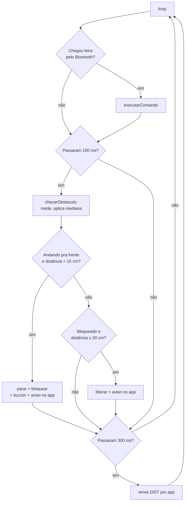

# Software

[← Voltar ao README](../README.md)

## 1. Códigos do repositório

| Código | O que é |
|---|---|
| [`code/arduino_carrinho_codigo`](../code/arduino_carrinho_codigo/arduino_carrinho_codigo.ino) | **Código final do carrinho** (Arduino Uno + HC-05, app serial) |
| [`code/carrinho_dabble`](../code/carrinho_dabble/carrinho_dabble.ino) | Versão alternativa para o app **Dabble** (módulo Gamepad) |
| [`code/carrinho_wifi_esp32`](../code/carrinho_wifi_esp32/carrinho_wifi_esp32.ino) | Protótipo de 21/08 com **ESP32 + Wi-Fi** (página web de controle) |
| [`code/testes/`](../code/testes/) | Códigos de teste de cada parte isolada (ver seção 6) |

Para gravar: abra o `.ino` na Arduino IDE, selecione a placa **Arduino Uno** e a porta COM, e clique em *Carregar*. O código final usa só bibliotecas que já vêm com a IDE (`SoftwareSerial`).

## 2. Estrutura do código final

O programa **nunca trava esperando** (sem `delay` longo no `loop`): a cada volta ele verifica se chegou comando e, a cada 100 ms, mede a distância. Isso é feito com `millis()`.

| Função | O que faz |
|---|---|
| `setup()` | Configura os pinos, deixa o carrinho parado e inicia a serial USB e o Bluetooth (9600 baud) |
| `loop()` | Lê comandos, verifica o sensor a cada 100 ms e envia a distância a cada 300 ms |
| `executarComando(c)` | Traduz a letra recebida em movimento |
| `frente()`, `re()`, `esquerda()`, `direita()`, `parar()` | Acionam os pinos IN1–IN4 da ponte H |
| `medirDistancia()` | Faz uma leitura do HC-SR04 em cm (999 = sem eco) |
| `checarObstaculo()` | Guarda a leitura, calcula a mediana, para/libera o carrinho |
| `mediana(a, b, c)` | Retorna o valor do meio entre três leituras |
| `alertaObstaculo()` | Toca o buzzer por 200 ms |

## 3. Controle dos motores

Cada motor tem dois pinos de direção na ponte H (IN1/IN2 e IN3/IN4). Um em `HIGH` e o outro em `LOW` gira o motor num sentido; invertendo, gira no outro; os dois em `LOW` param. Os pinos ENA/ENB ficam com jumper, então os motores sempre andam em velocidade máxima.

As curvas são feitas girando só uma roda: **esquerda** liga só o motor B (roda direita) e **direita** liga só o motor A (roda esquerda).

## 4. Comunicação sem fio (Bluetooth)

O HC-05 funciona como uma porta serial sem fio. O Arduino usa a biblioteca `SoftwareSerial` nos pinos D10 (RX) e D11 (TX), deixando a serial USB livre para depuração.

**Comandos recebidos** (uma letra por toque no app):

| Letra | Ação |
|---|---|
| `F` / `f` | Frente (recusada se houver obstáculo) |
| `B` / `b` | Ré |
| `L` / `l` | Esquerda |
| `R` / `r` | Direita |
| `S` / `s` | Parar |

Outros caracteres (como o "Enter" que o app manda depois de cada letra) são ignorados.

**Mensagens enviadas para o app:**

| Mensagem | Quando |
|---|---|
| `DIST: 45 cm` | A cada 300 ms |
| `OBSTACULO` | O carrinho parou sozinho por obstáculo |
| `BLOQUEADO` | Foi pedido "frente" com obstáculo na frente |
| `LIBERADO` | O caminho ficou livre (≥ 20 cm) |

## 5. Uso do sensor

1. A cada 100 ms o Arduino mede a distância com o HC-SR04.
2. A leitura entra num vetor com as **3 últimas leituras** e o programa usa a **mediana** delas. Assim, uma leitura errada sozinha (muito perto ou muito longe) é descartada. Esse filtro foi criado a partir dos testes (ver [T4](05-testes-e-resultados.md#t4--sensor-hc-sr04-isolado)).
3. **Andando para frente** e distância < 15 cm → para os motores, marca `bloqueadoPorObstaculo`, avisa o app e toca o buzzer.
4. Enquanto estiver bloqueado ou com obstáculo < 15 cm, o comando **frente é recusado** (ré e curvas continuam funcionando para o carrinho sair).
5. Quando a distância volta a ser ≥ 20 cm, o bloqueio é liberado. A diferença entre 15 e 20 cm (histerese) evita que o carrinho fique travando e destravando no limite.

A leitura usa `pulseInLong()` em vez de `pulseIn()` porque o `pulseIn()` mede errado (encurta a distância) quando chega um byte do Bluetooth durante a medição.

## 6. Códigos de teste

Criados para testar **uma parte por vez** e encontrar a causa dos problemas:

| Código | Testa | Como funciona |
|---|---|---|
| [`teste_motores`](../code/testes/teste_motores/teste_motores.ino) | Ponte H + motores | Liga motor A, motor B e os dois juntos, frente e ré, em ciclo |
| [`teste_bluetooth`](../code/testes/teste_bluetooth/teste_bluetooth.ino) | HC-05 | Mostra cada comando recebido com número e código ASCII e move os motores |
| [`teste_sensor`](../code/testes/teste_sensor/teste_sensor.ino) | HC-SR04 | Mostra a leitura bruta a cada 100 ms, marcando leituras "PERTO" e "sem eco" |
| [`teste_buzzer`](../code/testes/teste_buzzer/teste_buzzer.ino) | Buzzer | Testa pino ligado (buzzer ativo) e tom de 1000 Hz (buzzer passivo) |

## 7. Outras versões

- **Dabble** ([`code/carrinho_dabble`](../code/carrinho_dabble/carrinho_dabble.ino)): mesma lógica, mas o controle vem do módulo **Gamepad** do app Dabble (segurar a seta = andar, soltar = parar). Precisa da biblioteca *Dabble* (STEMpedia). A biblioteca já define um nome `BUZZER`, por isso nessa versão a constante se chama `PINO_BUZZER`.
- **Protótipo ESP32 + Wi-Fi** ([`code/carrinho_wifi_esp32`](../code/carrinho_wifi_esp32/carrinho_wifi_esp32.ino)): o ESP32 cria um servidor web; pelo navegador do celular aparecem os botões FRENTE/TRÁS/ESQ/DIR/PARAR, um controle de velocidade (PWM) e a distância do obstáculo, com trava de segurança a 20 cm.
