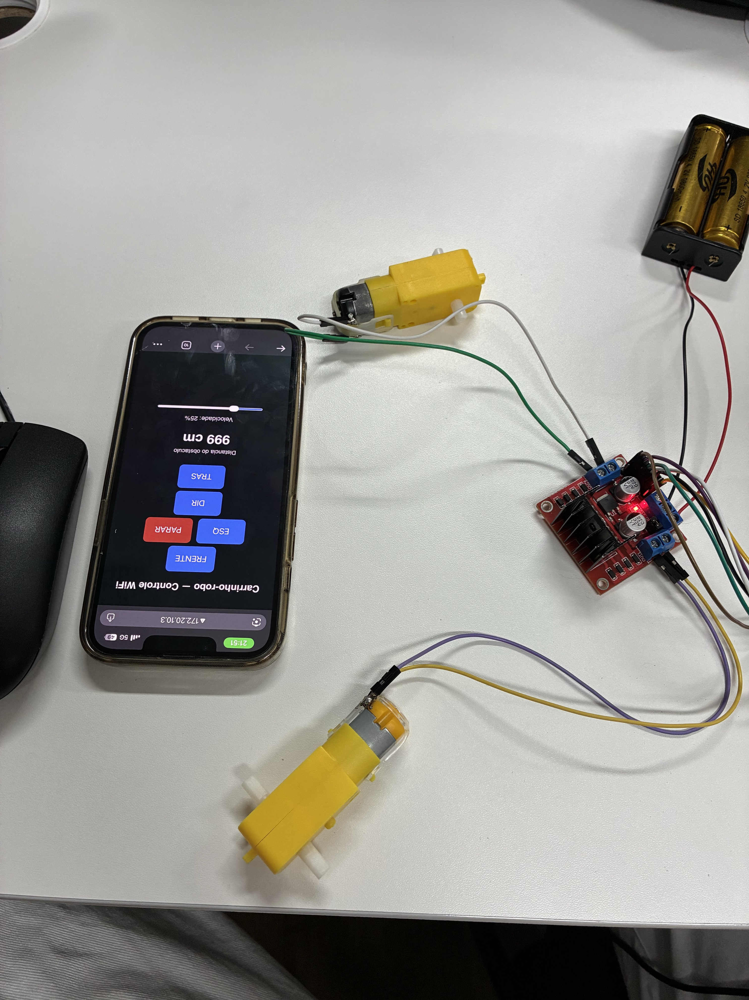
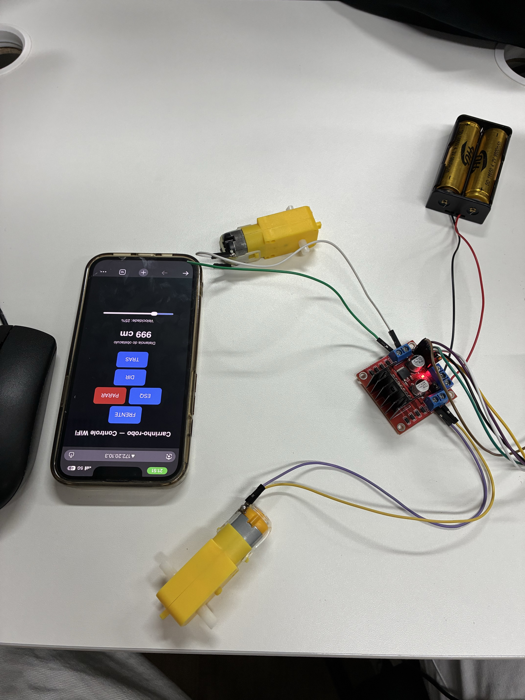

# Evidências e instruções de uso

[← Voltar ao README](../README.md)

## 1. Fotos do carrinho finalizado

<!-- PREENCHER: salve as fotos em image/ com estes nomes (ou ajuste os links) -->

 

## 2. Vídeos

| Vídeo | Link |
|---|---|
| Protótipo ESP32 + Wi-Fi na bancada (21/08) | [video/MicrosoftTeams-video.mp4](../video/MicrosoftTeams-video.mp4) |
| Demonstração do controle remoto (Bluetooth) | PREENCHER |
| Demonstração do sensor (parada por obstáculo) | PREENCHER |

> Dica: vídeos grandes podem ser enviados no YouTube (não listado) ou arrastados para uma *issue*/README no GitHub, que gera um link próprio.

## 3. Protótipo (21/08/2026)

 

## 4. Instruções de uso

### Ligar

1. Coloque as **4 pilhas AA** no suporte da ponte H e conecte a **bateria 9 V** no Arduino.
2. O LED da ponte H acende e o LED do HC-05 pisca rápido (aguardando conexão).

### Conectar o celular (Android)

1. Nas configurações de Bluetooth do celular, pareie com o **HC-05** (senha `1234` ou `0000`).
2. Abra o app de controle Bluetooth serial e conecte no HC-05. O LED do módulo passa a piscar devagar.
3. Configure os botões do app para enviar as letras abaixo.

### Comandos

| Botão | Letra | O que acontece |
|---|---|---|
| Frente | `F` | Anda para frente — **recusado** se houver obstáculo a menos de 15 cm (apita) |
| Ré | `B` | Anda para trás |
| Esquerda | `L` | Vira para a esquerda |
| Direita | `R` | Vira para a direita |
| Parar | `S` | Para |

O carrinho **continua no último movimento** até receber outro comando.

### Obstáculo

- Andando para frente, se algo ficar a **menos de 15 cm**, o carrinho **para sozinho**, apita e envia `OBSTACULO` para o app.
- Enquanto o obstáculo estiver na frente, **frente fica bloqueada** — use ré ou curvas para sair.
- Quando a distância passar de **20 cm**, o app recebe `LIBERADO` e é só apertar frente de novo.
- O app recebe a distância (`DIST: xx cm`) a cada 300 ms.

### Problemas comuns

| Problema | O que verificar |
|---|---|
| Um motor não gira ou gira fraco | Pilhas fracas; fio do GND comum preso no borne da ponte H; jumpers ENA/ENB |
| Não conecta no Bluetooth | HC-05 pareado no celular; LED piscando rápido = desconectado; app só funciona em Android |
| Não anda para frente | Tem algo a menos de 15 cm do sensor? Veja a distância no app |
| Uma roda gira ao contrário | Inverta os dois fios desse motor no borne OUT da ponte H |
| Curvas invertidas | Troque os motores de borne (OUT1/OUT2 ↔ OUT3/OUT4) |

### Depuração pelo computador

Com o cabo USB ligado, abra o **Monitor Serial em 9600** na Arduino IDE: aparecem os comandos recebidos, a distância e os eventos de obstáculo.
