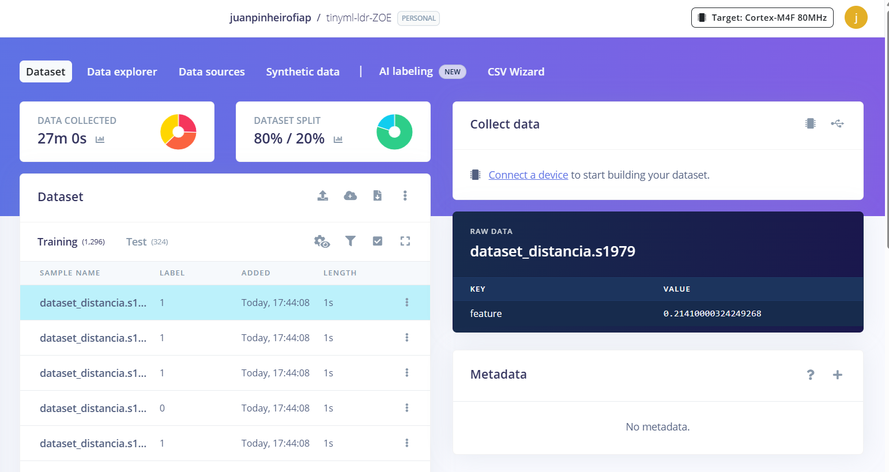
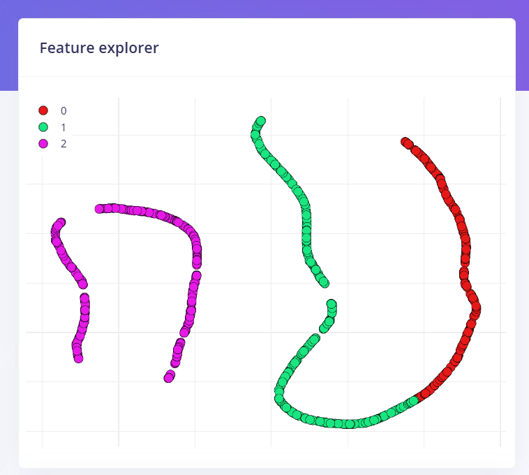
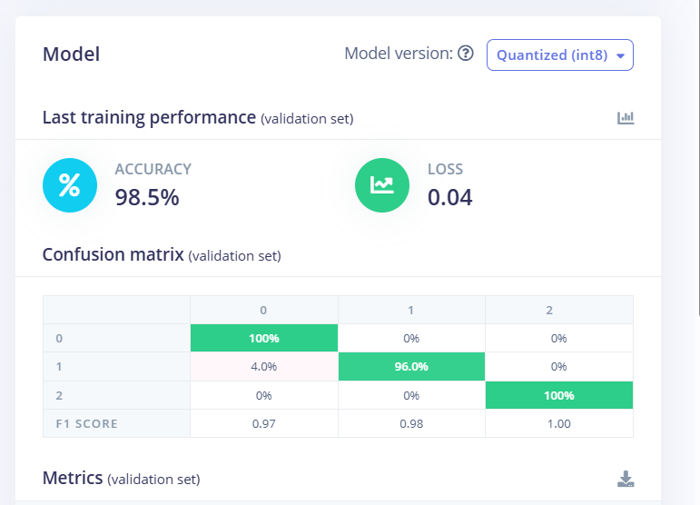
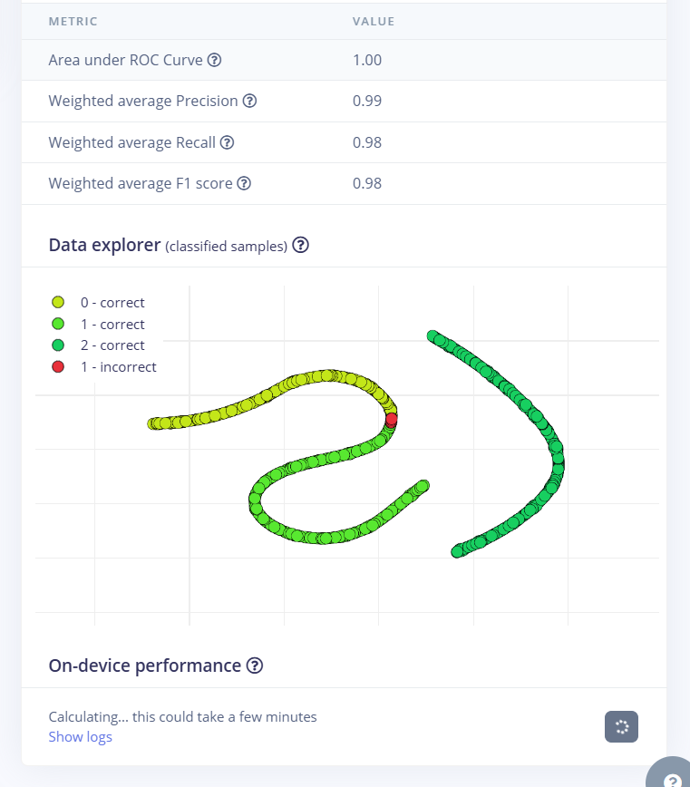

# TinyML: classificação de distância (Aulas 19 e 20)

[← Voltar ao README](../README.md)

Trabalho da disciplina **Project-based Maker Lab** (Profª Dra. Gedeane G.S. Kenshima): treinar um modelo de aprendizado de máquina com dados de um sensor e executá-lo dentro da ESP32, ligado ao carrinho.

- **Projeto no Edge Impulse (público):** <https://studio.edgeimpulse.com/public/1120730/live>
- Dados, scripts e biblioteca exportada: [`dados/tinyml/`](../dados/tinyml/README.md)
- Códigos: `code/tinyml/tinyml_a_leitura_bruta`, `code/tinyml/tinyml_b_preprocessamento`, `code/tinyml/tinyml_c_modelo` e `code/carrinho_esp32_ps4_ia`

## 1. Sensor escolhido (Aula 19)

**HC-SR04** (ultrassônico), ligado à ESP32: TRIG no GPIO 18 e ECHO no GPIO 19, por um divisor de tensão de 1 kΩ + 2 kΩ (o ECHO manda 5 V e a ESP32 só aguenta 3,3 V).

| Item | Valor |
|---|---|
| Variável | distância até o obstáculo, em **cm** (contínua) |
| Faixa nominal do sensor | 2 a 400 cm |
| Resolução observada | degraus de cerca de 0,4 cm |
| Sem eco | o sensor devolve tempo zero; no código vira `-1` |
| Taxa de leitura | 10 leituras por segundo |

### Caracterização do sinal

Com o objeto **parado**, o sinal é muito estável (distâncias de referência estimadas à mão, por isso aproximadas):

| Referência | Leituras | Média | Mínimo | Máximo | Desvio |
|---|---|---|---|---|---|
| ~10 cm | 51 | 12,91 cm | 12,73 | 13,15 | 0,20 |
| ~30 cm | 16 | 25,16 cm | 24,92 | 25,35 | 0,20 |
| ~100 cm | 28 | 83,19 cm | 82,58 | 83,91 | 0,41 |

Com o objeto **em movimento** ou fora do feixe apareceram valores errados: `-1` (sem eco), ecos do fundo entre 80 e 180 cm e saltos de 306 a 422 cm. O menor valor lido foi **3,4 cm**. Esse ruído justifica o pré-processamento.

## 2. Pré-processamento (`tinyml_b_preprocessamento`)

1. **Limitação de faixa:** valores limitados a 2–200 cm. Sem eco conta como 200 cm.
2. **Média móvel** das 5 últimas leituras (cerca de 0,5 s).
3. **Normalização** para 0–1: `(média − 2) / (200 − 2)`.

O valor exibido na serial já não é a leitura crua. A parte A (`tinyml_a_leitura_bruta`) só lê e mostra o valor cru.

## 3. Classes

| Classe | Nome | Critério (média em cm) |
|---|---|---|
| 0 | PERTO | menor que 20 |
| 1 | MEDIO | de 20 até 60 |
| 2 | LONGE | 60 ou mais |

Tipo de problema: **classificação**, 3 classes, 1 característica (`feature`).

## 4. Coleta do CSV

Formato `feature,label`, capturado direto da serial por `capturar_csv.py`. O sketch rotula cada linha pela distância medida.

| Captura | Duração | Linhas |
|---|---|---|
| perto | 60 s | 595 |
| médio | 60 s | 595 |
| longe | 40 s | 395 |
| transição (cruzando 20 e 60 cm) | 40 s | 395 |
| **Total** | | **1.980** |

Por classe: perto 544 (27%), médio 757 (38%), longe 679 (34%). A captura de transição foi feita para ter amostras perto de 20 cm; perto de 60 cm ainda sobrou um buraco de 3,4 cm (57,3 a 60,7 cm).

## 5. Treino no Edge Impulse (Aula 20)

| Configuração | Valor |
|---|---|
| Projeto | `tinyml-ldr-ZOE` (Personal, público) |
| Bloco de entrada | Raw data |
| Bloco de aprendizado | Classification |
| Ciclos de treino | 20 |
| Learning rate | 0.005 |
| Versão do modelo | **Quantized (int8)** |
| Divisão | 80% treino / 20% teste |

Upload pelo CSV Wizard: separador vírgula, com cabeçalho, dados que **não** são série temporal (uma amostra por linha), rótulo na coluna `label` e valor na coluna `feature`.

### Resultados (conjunto de validação)

| Métrica | Valor |
|---|---|
| Accuracy | **98,5%** |
| Loss | **0,04** |
| Área sob a curva ROC | 1,00 |
| Precisão / Recall / F1 (médias ponderadas) | 0,99 / 0,98 / 0,98 |

Matriz de confusão (linha = classe real, coluna = classe prevista):

| | previu 0 | previu 1 | previu 2 |
|---|---|---|---|
| **real 0 (perto)** | 100% | 0% | 0% |
| **real 1 (médio)** | 4% | 96% | 0% |
| **real 2 (longe)** | 0% | 0% | 100% |

O único ponto errado do conjunto de validação fica na fronteira entre perto e médio, perto de 20 cm. A página pública do projeto também informa acurácia de 99,1% no conjunto de teste.

> **Observação:** o Edge Impulse mostra 1.620 amostras (1.296 de treino e 324 de teste), enquanto o CSV enviado tem 1.980 linhas. A causa dessa diferença não foi confirmada.

<!-- PREENCHER: print da tela Classifier com o nome do projeto visível no topo (a professora pede o nome do projeto no print). Salvar em image/. -->

## 6. Modelo dentro da ESP32 (`tinyml_c_modelo`)

A biblioteca exportada (`dados/tinyml/ei-tinyml-ldr-zoe-arduino-1.0.1.zip`) foi instalada na Arduino IDE. O sketch faz o mesmo pré-processamento, entrega o valor normalizado ao modelo e compara a resposta com a regra de 20 e 60 cm.

| Item | Valor |
|---|---|
| Entrada do modelo | 1 valor (distância normalizada) |
| Saídas | 3 classes |
| Tempo de cada previsão | 0 a 1 ms |
| Programa na ESP32 | 330 KB (25% da memória de programa) |

**Teste com o sensor real** (`testar_modelo.py`, objeto movido entre 11 e 64 cm): **395 leituras**, o modelo concordou com a regra em **92,7%** (366 de 395), com confiança média de 91%. As 29 discordâncias ficaram todas perto das fronteiras:

- entre 20,0 e 22,4 cm o modelo disse PERTO (a regra diz MEDIO);
- entre 59,0 e 59,8 cm o modelo disse LONGE (a regra diz MEDIO).

Ou seja, o modelo aprendeu as classes, mas a fronteira dele fica uns 2 cm acima de 20 cm e uns 1 cm abaixo de 60 cm. Longe das fronteiras acertou todas. O log está em `dados/tinyml/teste_modelo_placa.txt`.

## 7. Integração no carrinho (`carrinho_esp32_ps4_ia`)

O carrinho lê o sensor na frente, roda o modelo e reage:

| O modelo diz | O que acontece |
|---|---|
| **PERTO** | com o R2 apertado, a frente é **bloqueada** (luz vermelha, vibração forte no controle); a ré continua livre |
| **MEDIO** | andando para a frente, luz **roxa** e vibração leve de aviso |
| **LONGE** | funcionamento normal |

Para não ficar alternando de classe na fronteira (o motor faria "frente, para, frente, para"), a classe só muda após algumas leituras iguais seguidas: entrar em PERTO é imediato (segurança), sair de PERTO exige 5 leituras (0,5 s) e as outras mudanças exigem 3 (0,3 s).

O sketch compila para a ESP32 com o pacote Bluepad32 e ocupa 59% da memória de programa. Os testes no carrinho (bloqueio da frente, vibração, ré, luzes e a versão com a histerese) passaram.

## 8. Limitações

- O critério das classes é um limite de distância, então o modelo praticamente reaprende essa regra; o valor do trabalho está no caminho completo (sensor, pré-processamento, dados, treino e execução na placa).
- A fronteira do modelo não é exatamente 20 e 60 cm (seção 6). Mais capturas de 20 a 26 cm e de 57 a 61 cm melhorariam isso, mas exigem treinar e compilar tudo de novo.
- O HC-SR04 lê mal superfícies moles ou inclinadas; os testes usaram um objeto liso e reto.
- A primeira compilação com a biblioteca do modelo leva cerca de 17 minutos (875 arquivos).
